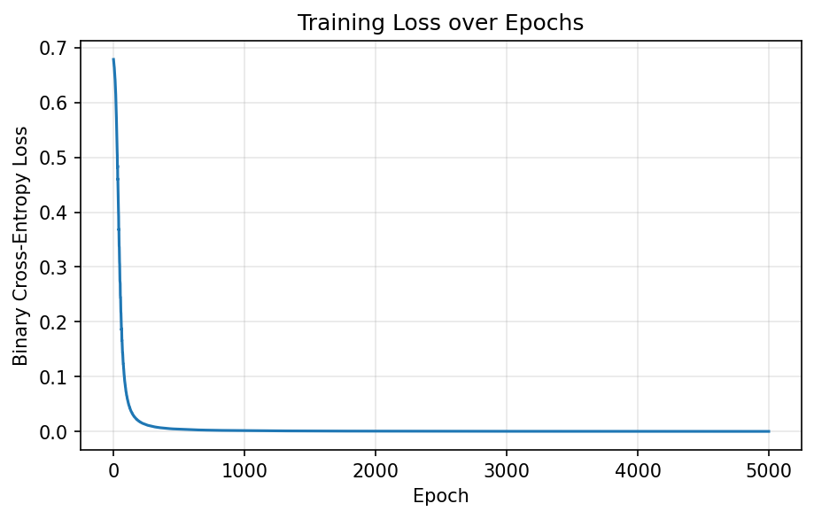

# Neural Network From Scratch

A feedforward neural network implemented from scratch using only **NumPy** — no PyTorch, no TensorFlow, no autograd. Built to understand exactly what happens inside a neural network during forward propagation, backpropagation, and gradient descent.



## Why this project?

Deep learning frameworks abstract away the matrix calculus that makes neural networks work. This project reimplements that calculus by hand:

- Forward propagation through a hidden layer and output layer
- Binary cross-entropy loss
- Manual gradient derivation and backpropagation
- Gradient descent weight updates

The network is trained on **XOR**, the classic toy problem that a single-layer (linear) model cannot solve, making it a minimal but meaningful proof that the hidden layer and backpropagation are actually working.

## Architecture

```
Input (2)  --->  Hidden Layer (4 neurons, ReLU)  --->  Output Layer (1 neuron, Sigmoid)
```

**Forward pass:**

```
Z1 = W1 . X + b1
A1 = ReLU(Z1)
Z2 = W2 . A1 + b2
A2 = Sigmoid(Z2)
```

**Loss (Binary Cross-Entropy):**

```
L = -mean( y*log(A2) + (1-y)*log(1-A2) )
```

**Backward pass** derives gradients for `W1, b1, W2, b2` via the chain rule and updates them with gradient descent:

```
W := W - learning_rate * dW
b := b - learning_rate * db
```

## Project structure

```
neural-network-from-scratch/
├── README.md
├── requirements.txt
├── LICENSE
├── src/
│   └── neural_network.py     # NeuralNetwork class + XOR training script
├── tests/
│   └── test_network.py       # Unit tests (pytest)
└── assets/
    └── loss_plot.png         # Training loss curve
```

## Getting started

```bash
git clone https://github.com/<your-username>/neural-network-from-scratch.git
cd neural-network-from-scratch
pip install -r requirements.txt
python src/neural_network.py
```

Expected output: the loss drops from ~0.7 to near-zero over 5000 epochs, and the network correctly predicts all four XOR cases.

## Running tests

```bash
pytest tests/ -v
```

8 tests cover activation functions, output shapes/ranges, loss non-negativity, training convergence, and correct XOR classification.

## Results

| Input  | Predicted | Target |
|--------|-----------|--------|
| [0, 0] | ~0.00     | 0      |
| [0, 1] | ~1.00     | 1      |
| [1, 0] | ~1.00     | 1      |
| [1, 1] | ~0.00     | 0      |

## Roadmap

- [ ] Add support for arbitrary hidden layer counts (deep network, not just 1 hidden layer)
- [ ] Mini-batch gradient descent
- [ ] Additional activation functions (tanh, leaky ReLU)
- [ ] Compare against a from-scratch C implementation

## License

MIT — see [LICENSE](LICENSE).
